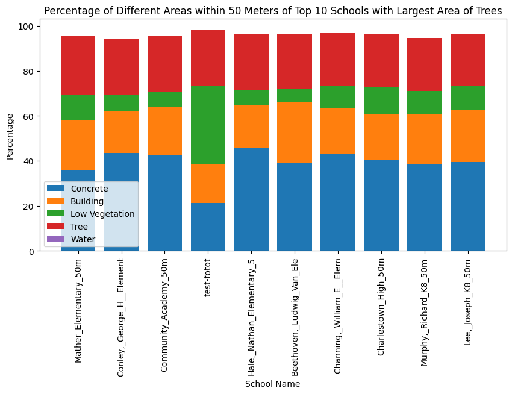
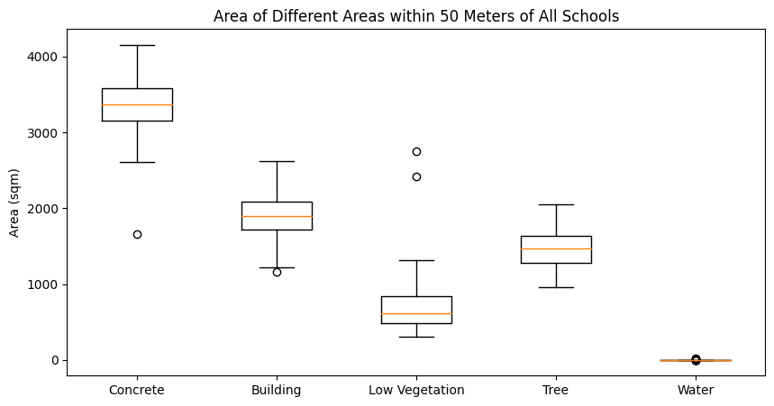

# BU School of Public Health - Greenspace Ecosystem Services in K-12 schools
The goal of this specific machine learning project is to characterize ecosystem services (ES) disparities in K-12 schools in the US using satellite and street view imagery and ML image understanding techniques. 

# Structure
```
├── .github
├── notebooks
├── results 
├── SegForestNet
├── window-segmentation
├── .gitignore
├── COLLABORATORS
├── LICENSE
├── Project Outline.md # start here for an overview
├── README.md
├── research.md
├── SegForestNet-50m.ipynb
└── Team Agreement Outline.md
```

# Getting Started 
## notebooks
- [00-eda.ipynb](notebooks/00-eda.ipynb) - visualizes aerial images
- [01-mask_rcnn.ipynb](notebooks/01-mask_rcnn.ipynb) - visualizes annotated data and demonstrates how to train Mask-RCNN on 50m school aerial images
- [02_resnet_unet.ipynb](notebooks/02_resnet_unet.ipynb) - inference results of InceptionResNetV2-UNet on 500m school aerial images. Demonstrates complete workflow of aerial images to a queryable dataset
- [03_google_map_fetch.ipynb](notebooks/03_google_map_fetch.ipynb) - results to fetch google map, google earth images. 
- [SegForestNet-50m.ipynb](https://github.com/davidchd/SegForestNet/blob/main/greenspace-deploy-50m-origin.ipynb) - segmenting result by running SegForestNet on 50m-buffered aerial images, more info on SegForestNet/ module
- [05-results.ipynb](notebooks/05-results.ipynb) - to be updated

## data

We are using satelite images obtained from google map static api, as well as google street view to train our models.

- [aerial images](https://drive.google.com/drive/folders/1EKbQkQ2RrbqBQrQHzJ3ojXfQXJiULSLH)
- [update_aerial_images](https://drive.google.com/drive/folders/13Qv8GEMoUm6i98ANcl_dMnS03v_L8_G3)


## Results

### SegForest segmentation results

| School_Name                  | Area_50m_Concrete_percent | Area_50m_Concrete_sqm | Area_50m_Building_percent | Area_50m_Building_sqm | Area_50m_LowVege_percent | Area_50m_LowVege_sqm | Area_50m_Tree_percent | Area_50m_Tree_sqm | Area_50m_Water_percent | Area_50m_Water_sqm |
|------------------------------|---------------------------|------------------------|----------------------------|-----------------------|---------------------------|----------------------|-----------------------|--------------------|------------------------|---------------------|
| Kennedy,_Patrick_Elementary | 51.353872                 | 4033.323642           | 24.039889                  | 1888.088459          | 5.207927                  | 409.029607           | 15.473146             | 1215.258023        | 0.0                    | 0.0                 |
| Ellis,_David_A__Elementary  | 42.673967                 | 3351.605550           | 21.292372                  | 1672.298949          | 13.428550                 | 1054.675839          | 19.391205             | 1522.981689        | 0.0                    | 0.0                 |
| Blackstone,_William_Elementary | 38.862666              | 3052.266631           | 24.737393                  | 1942.870282          | 13.238130                 | 1039.720274          | 17.907136             | 1406.423145        | 0.0                    | 0.0                 |
| Otis,_James_Elementary_50    | 44.975342                 | 3532.355066           | 28.053452                  | 2203.312993          | 6.243295                  | 490.347262           | 15.632192             | 1227.749465        | 0.0                    | 0.0                 |
| Community_Academy_of_Science | 45.677275                 | 3587.484817           | 26.534471                  | 2084.012453          | 7.153933                  | 561.868603           | 14.955684             | 1174.616659        | 0.0                    | 0.0                 |



